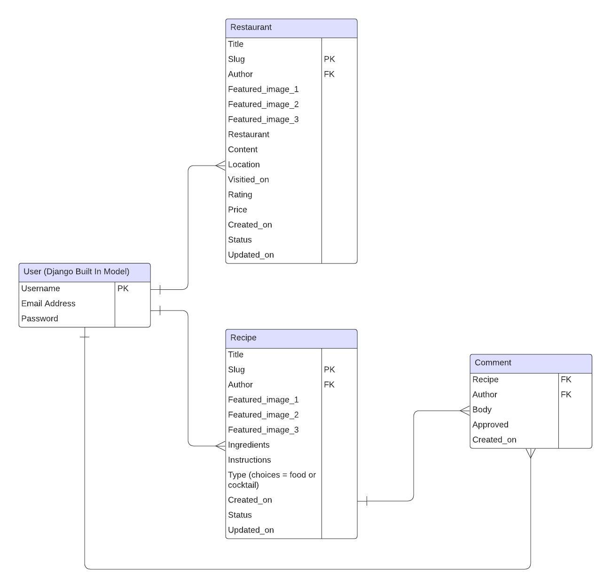
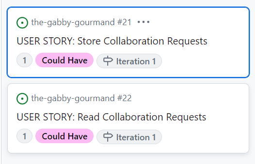

# The Gabby Gourmand

Live Version: [The Gabby Gourmand](https://gabby-gourmand-a59f21db8e77.herokuapp.com/)

Repository: [GitHub Repo](https://github.com/Jem212Mac/the-gabby-gourmand)

Developed by [Jemima MacKenzie](https://github.com/Jem212Mac).

## About
This is a website intended to provide interested parties with a review of various restaurants.  The intended user of the site is someone who is interested in food (a foodie) who loves to dine out but also likes to cook and try new recipes.  The home page for the site provides the user with a list of restaurant reviews that they can look through to help them decide on where to dine out next, but the site also includes a page listing food recipes and a page listing cocktail recipes where users can leave comments.

## UX Design
The target audience for the site would be foodies that potentially love to travel, to eat, and to cook and make cocktails.  They would likely be cultured and sophisticated people, and as such I wanted to style the site with a clean, clear, uncluttered and sophisticated design with a colour scheme that makes the site feel modern.  I chose a fairly muted colour pallete with mostly black, white and grey, but with an occasional pop of colour coming from pink headings and buttons.  I felt that this would provide the ideal backdrop for the colourful plates of food and cocktails that would be displayed in featured images.  At the outset of the project, I created the following wireframe designs using [Figma](https://www.figma.com/):

## Database Scheme

The planning and design of the wireframes helped me to decide on the database schema I would need, and this was created using [LucidChart](https://www.lucidchart.com/), as shown below:

As detailed above, the main database models for the site are the review and recipe models.  The user model comes from the Django built in model.  There is also a model to allow comments to be left for recipes, but not reviews.  I did not want users to be able to add comments to reviews since my aim for the site was to encourage restaurant owners to make requests to the site admins for restaurant reviews, without the fear of having random user comments added to their reviews.  Restaurant reviews would include an overall rating and a measure of the price / cost of a meal at the restaurant.  Recipes, however, are more informal blog posts where users can add comments that perhaps suggest the use of a different ingredient or technique to make the recipe better.  Recipes can be either 'food' or 'cocktail' recipes through the use of 'choices' on the type field.

## Features & User Story Planning

In order to plan the project, I used agile methodologies.  I created a project kanban board and populated it with a number of user stories (see below), based on the following epics.

I decided on two iterations for the project.  My main aim for the first iteration would be to complete most of the user stories, while the second iteration would focus more on styling the website, testing the website and completing documentation.  I used MoSCow prioritisation to prioritise the user stories and tasks in each iteration.  I estimated user stories and tasks based on the following user story since I thought it was one of the smallest pieces of work to be undertaken.  Giving this an estimate of one story point, I estimated other user stories relative to this one using a Fibonnaci sequence.

Since I had no 'team velocity' measures to use to give an indication of how many story points I could complete in an iteration, I estimated, based on my baseline user story, that I could complete 50 story points per iteration.  As such, I ensured that iteration one included no more that 30 story points (60%) that were MUST HAVE or COULD HAVE priorities.  The kanban board for iteration one at the outset looked like this:

Towards the end of Iteration 1, I found that I had completed all of the tasks and user stories for the iteration, and I had some time left spare.  Therefore, I moved some more user stories from the backlog to Iteration 1:

These additional user stories totalled 5 story points, so by the end of iteration 1 I had completed 55 story points, and this provided me with a 'velocity' measure that I could use for Iteration 2.

## Local Development

## Testing
For details of all testing performed, including validator testing, manual testing, and automated testing, please see TESTING.md.  This also includes details of bugs found and resolved throughout the development process.

## Forking

## Deployment

## Future Enhancements

## Credits & Acknowledgements