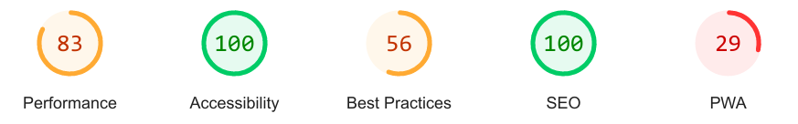
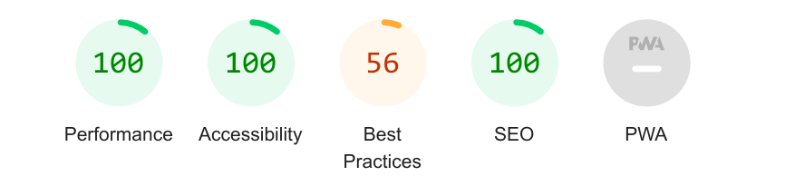
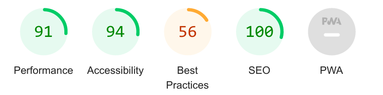
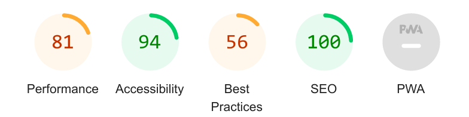
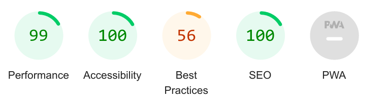
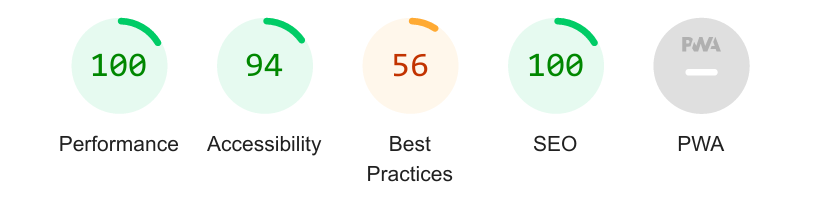
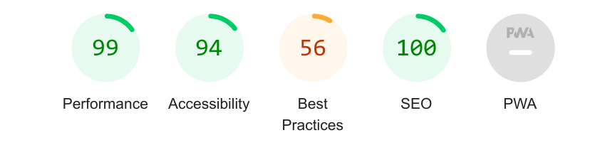
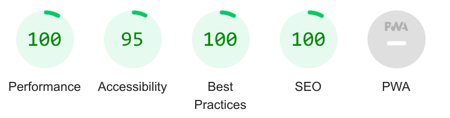
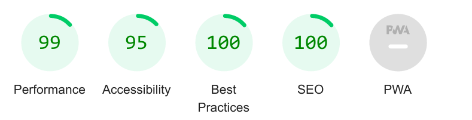
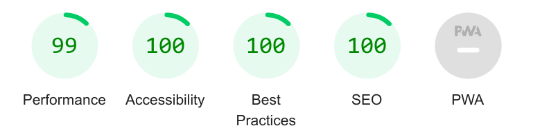

# Testing

## Manual Testing

### User Story Testing

Testing was done throughout site development, for each feature before it was merged into the master file.

User Story [#8](https://github.com/Jem212Mac/the-gabby-gourmand/issues/8)

| Test Case ID | Test Objective | Steps | Expected results | Status | Comments / Screenshots |
| -------------| ---------------| ----- | --------------   | -------| ---------------------- |
|       1      | Check that logged in site admin can create a new review post in django admin | Log in to django admin function with site admin credentials & click to add a review.  Add review detail and save. | Review is saved and visible in django admin.| Passed ||
| 2 | Check that logged in site admin can create a new food recipe post in django admin | Log in to admin function with site admin credentials & click to add a recipe.  Add recipe detail.  Save the recipe with status = 0. | Recipe is saved and visible in django admin | Passed |  |
| 3 | Check that logged in site admin can create a new cocktail recipe post in django admin | Log in to admin function with site admin credentials & click to add a recipe.  Add recipe detail.  Save the recipe with status = 1. | Recipe is saved and visible in django admin | Passed |  |
|  |  |  |  |  |  |
|  |  |  |  |  |  |

---

Usability was tested with the below user acceptance testing, sent to new users to ensure testing from different users, on different devices and browsers to ensure issues were caught and where possible fixed during development.

|     | User Actions           | Expected Results | Y/N | Comments    |
|-------------|------------------------|------------------|------|-------------|
| Sign Up     |                        |                  |      |             |
| 1           |                        |                  |      |             |

---

## Bugs

---

## Validation:

### HTML Validation:

- [Full HTML Validation Report](documentation/validation/html_validation.pdf)

- No errors or warnings were found when passing through the official [W3C](https://validator.w3.org/) validator, except for errors resulting from the use of Django Summernote.

### CSS Validation:

- [Full CSS Validation Report](documentation/validation/css_validation.png)

- No errors or warnings were found when passing through the official [W3C (Jigsaw)](https://jigsaw.w3.org/css-validator/) validator.

### JS Validation:

- [Full JS Validation Report](documentation/validation/js_validation.png)

- No errors or warning messages were found when passing through the official [JSHint](https://www.jshint.com/) validator, except for an error related to the use of Bootstrap.

### Python Validation:

- [Full Python Validation Report](documentation/validation/python_validation.pdf)

- No errors were found when the code was passed through the [CI Python Linter](https://pep8ci.herokuapp.com/).  This checking was done manually by copying python code and pasting it into the validator.

---
## Lighthouse Reports

### Home Page

### About Page

### Food Recipes Page

### Cocktail Recipes Page

### Review Details Page

### Review Food Details Page

### Review Cocktail Details Page

### Sign Up Page

### Sign In Page

### Sign Out Page

---